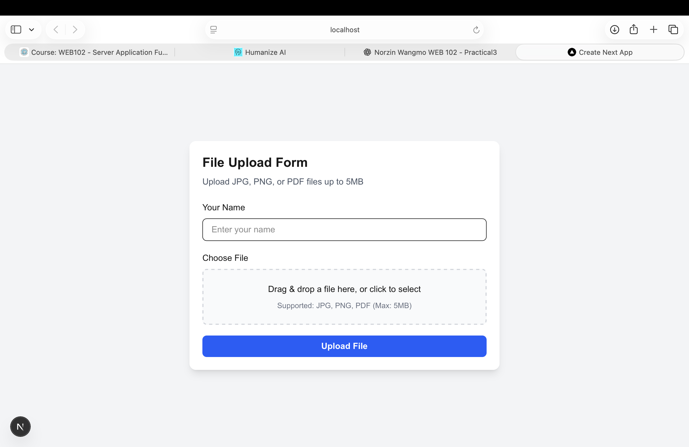
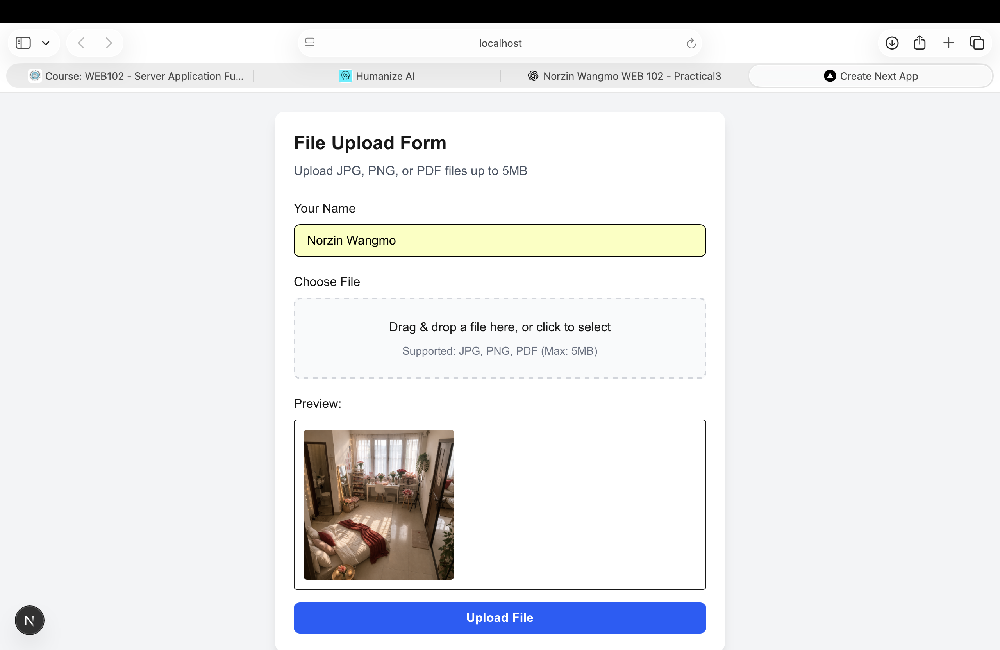
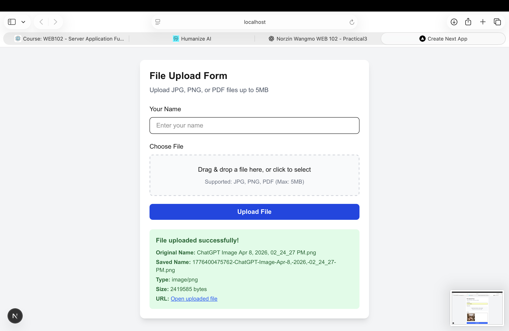
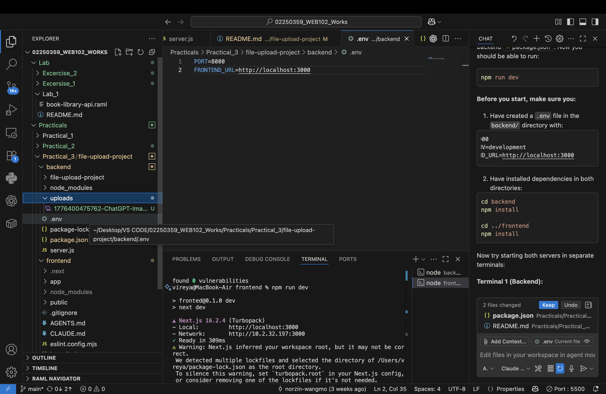

# Practical 3 — Reflection

**Student ID:** 02250359  
**Module:** WEB102  
**Practical:** File Upload (Full Stack)

---

## a) Documentation — Main concepts applied

### Multipart form uploads
Browsers send files using **`multipart/form-data`**, not raw JSON. **Multer** parses this on Express and exposes `req.file` with metadata (`originalname`, `mimetype`, `size`, `path`).

### Disk storage strategy
`multer.diskStorage` defines:
- **destination** — `backend/uploads/`  
- **filename** — timestamp + sanitized original name to prevent overwrites  

### Static file serving
`express.static` on `/uploads` lets clients open uploaded files by URL without a separate download handler.

### CORS for full-stack apps
The Next.js app runs on port **3000** and the API on **8000**—different origins. **CORS** middleware whitelists `FRONTEND_URL` so the browser allows Axios requests.

### Frontend integration
- **React Dropzone** — drag-and-drop UX  
- **React Hook Form** — form state and validation  
- **Axios** — `FormData` POST with correct `Content-Type` (browser sets boundary automatically)  

### Security basics
- **MIME type filter** — reject unsupported files  
- **Size limits** — configurable in Multer  
- **Safe filenames** — replace spaces in names  

---

## b) Reflection — What I learned

### What I learned
- The difference between uploading **JSON** and **files** in HTTP.  
- How to connect a **React/Next.js** UI to a separate Express API.  
- Why **environment variables** (`FRONTEND_URL`, `PORT`) matter for local development.  
- How timestamp prefixes prevent **filename collisions**.  
- That full-stack debugging often means checking **two terminals** (frontend + backend logs).

### Challenges faced and how I overcame them

#### 1. CORS blocked requests
**Challenge:** Browser console showed CORS errors when uploading from Next.js.  
**How I fixed it:** Set `FRONTEND_URL=http://localhost:3000` in backend `.env` and restarted the API.

#### 2. Invalid file type errors
**Challenge:** Upload failed for some files with “Invalid file type”.  
**How I fixed it:** Checked `allowedMimeTypes` in `server.js` and only tested JPEG, PNG, and PDF as configured.

#### 3. Frontend could not reach backend
**Challenge:** Wrong API URL in Axios caused network errors.  
**How I fixed it:** Pointed Axios base URL to `http://localhost:8000` and confirmed backend health at `GET /`.

#### 4. Verifying files on disk
**Challenge:** Unsure if upload succeeded when UI was unclear.  
**How I fixed it:** Opened `backend/uploads/` and confirmed timestamped files (see screenshots below).

---

## Summary

Practical 3 combined **backend file handling** with a **modern frontend**. It prepared me for Practical 5, where uploads move from local disk to **cloud storage (Supabase)** while the UI still uploads from the browser.
