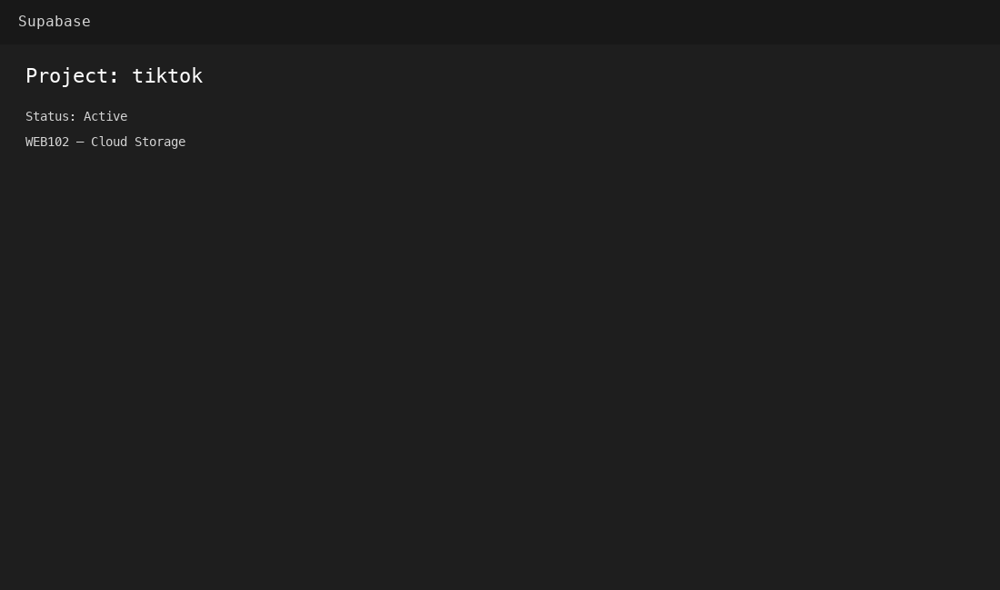
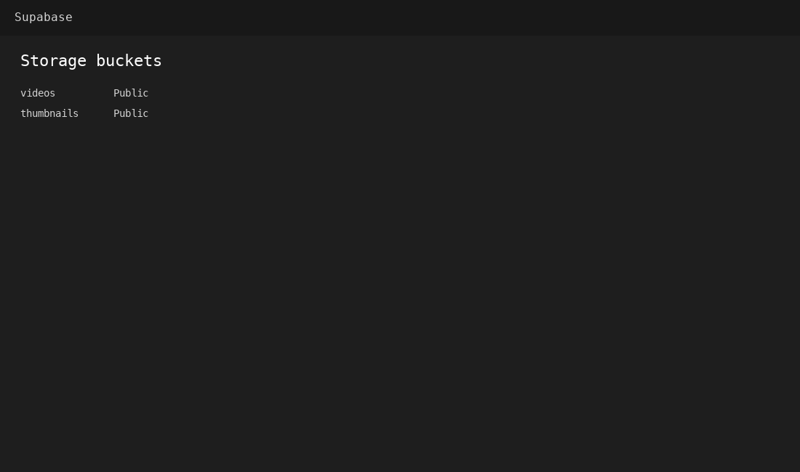
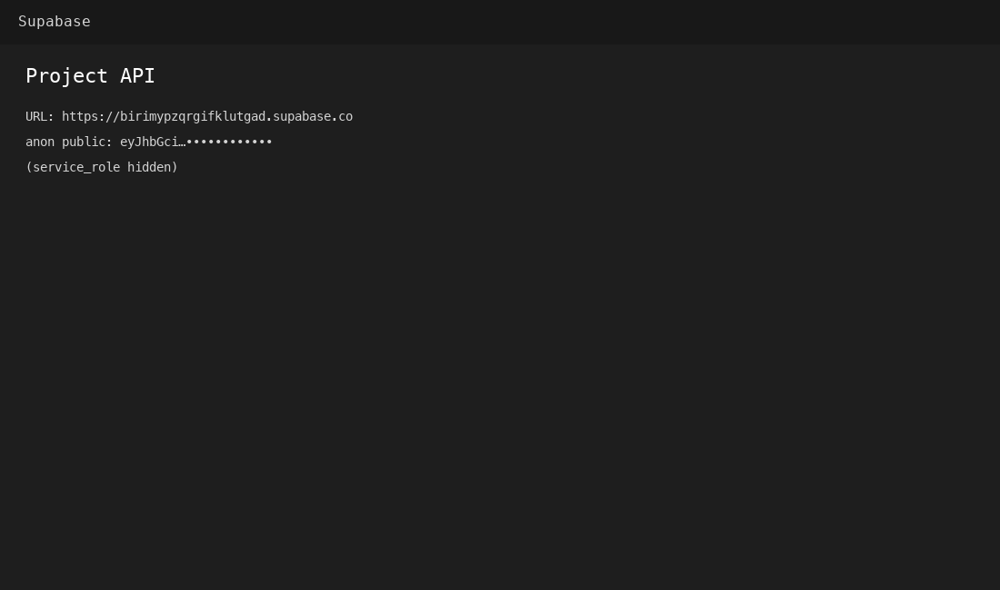
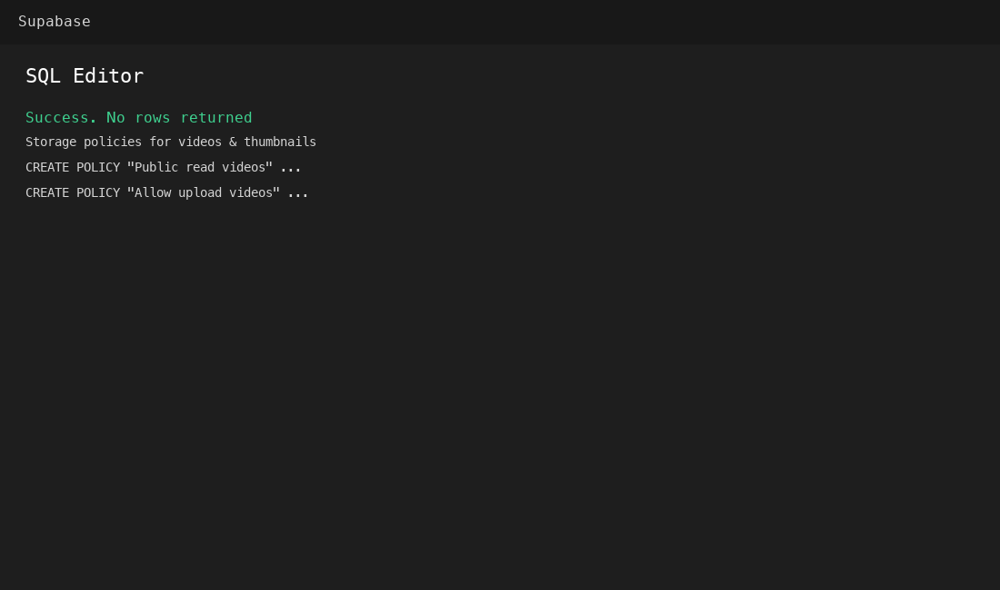
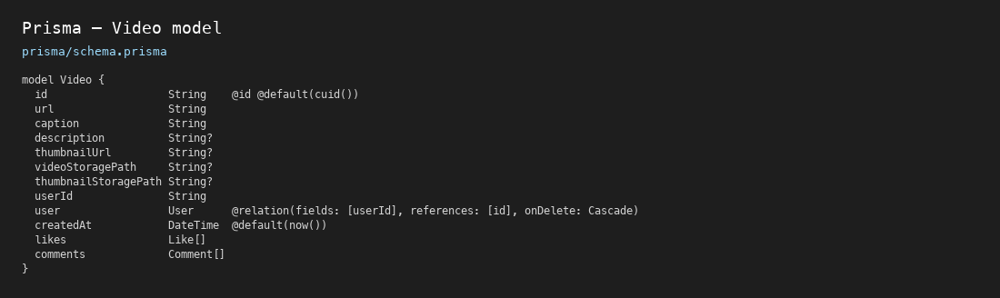
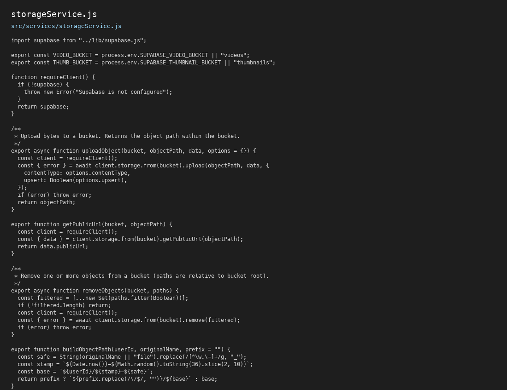
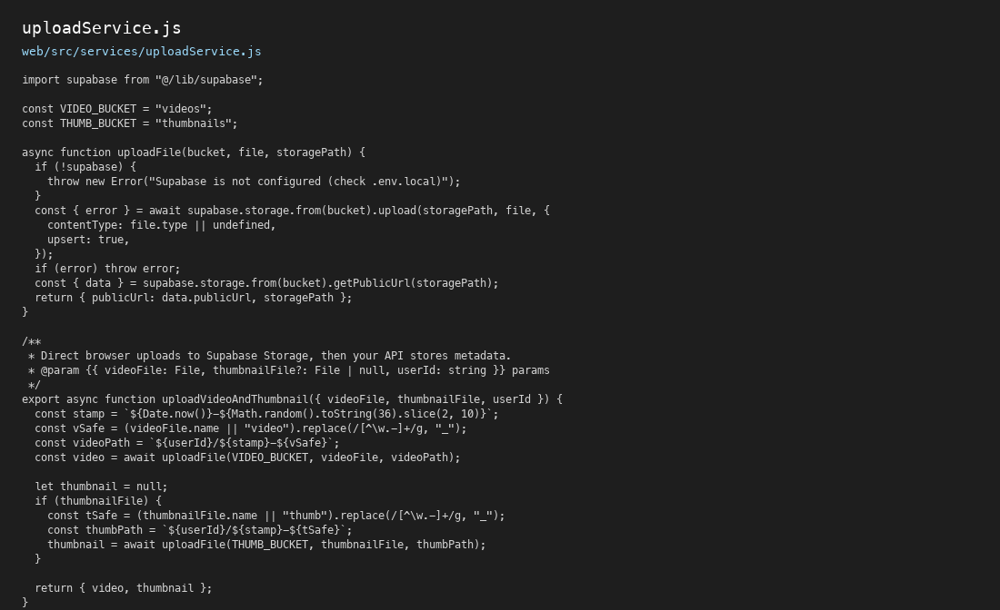
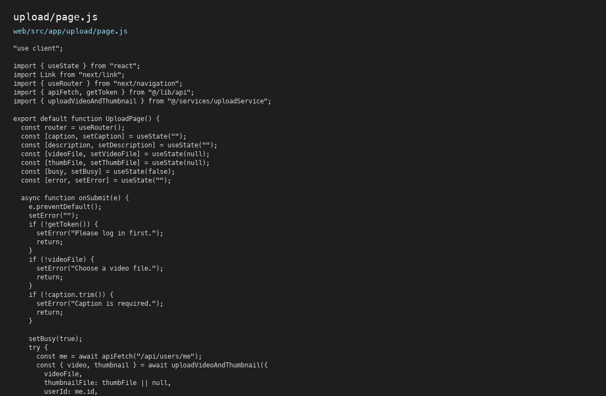
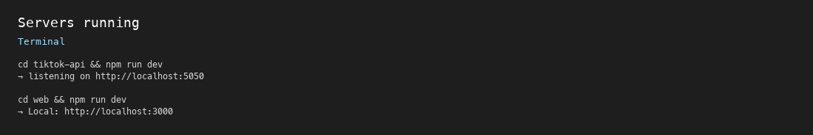

# Practical 5 — Cloud Bucket Storage (Supabase)

**Student ID:** 02250359  
**Module:** WEB102  
**Project folder:** `tiktok-api/` (API) + `tiktok-api/web/` (Next.js frontend)  
**Full report:** [WEB102_Practical_5_Report.md](./WEB102_Practical_5_Report.md)

---

## Aim

Migrate the TikTok clone from **local disk storage** (`uploads/`) to **Supabase Storage** so videos and thumbnails are stored in the cloud, served via CDN URLs, while the database keeps only metadata (URLs and storage paths).

---

## Instructions (from practical)

1. Create a Supabase project and **public** buckets: `videos`, `thumbnails`.  
2. Apply **storage RLS policies** for anon upload and public read.  
3. Add Supabase credentials to server `.env` and `web/.env.local`.  
4. Install `@supabase/supabase-js` on API and web.  
5. Implement server `storageService` and update video controller (create/delete).  
6. Add `videoStoragePath` and `thumbnailStoragePath` to Prisma schema.  
7. Implement **browser direct upload** in Next.js, then `POST /api/videos` with URLs.  
8. Optional: migrate old local files; disable `SERVE_LOCAL_UPLOADS`.  
9. Test and document with screenshots.

---

## Technology stack

| Component | Role |
|-----------|------|
| Supabase Storage | Cloud buckets + CDN |
| @supabase/supabase-js | Client (server + browser) |
| Express + Prisma (SQLite) | API and metadata |
| Next.js | Upload UI and video feed |
| JWT | App login (separate from Supabase Auth) |

---

## Setup

### 1. Supabase project
- Sign up at [supabase.com](https://supabase.com)  
- Create project → **Storage** → buckets `videos` and `thumbnails` (both **Public**)  
- Run policy SQL from `tiktok-api/scripts/supabase-storage-policies.sql` in SQL Editor  

### 2. API (`tiktok-api/`)

```bash
cd tiktok-api
npm install
cp .env.example .env
# Fill SUPABASE_URL, SUPABASE_SERVICE_KEY, SUPABASE_PUBLIC_KEY
npm run db:push
npm run dev
```

API runs at http://127.0.0.1:5050

### 3. Web (`tiktok-api/web/`)

```bash
cd tiktok-api/web
npm install
```

Create `web/.env.local`:

```env
NEXT_PUBLIC_SUPABASE_URL=https://your-project.supabase.co
NEXT_PUBLIC_SUPABASE_PUBLIC_KEY=your-anon-key
NEXT_PUBLIC_API_URL=http://127.0.0.1:5050
```

```bash
npm run dev
```

App: http://localhost:3000

---

## Solution — upload flow

```
User selects video in browser
    → uploadService uploads to Supabase buckets (anon key)
    → browser POST /api/videos with videoUrl, videoStoragePath, caption
    → Prisma saves metadata in SQLite
    → Feed plays video from Supabase HTTPS URL
```

### Key files
| File | Purpose |
|------|---------|
| `src/lib/supabase.js` | Server client (service role) |
| `src/services/storageService.js` | Upload, URL, delete |
| `src/controllers/videoController.js` | Save paths; delete from bucket |
| `web/src/lib/supabase.js` | Browser client (anon key) |
| `web/src/services/uploadService.js` | Direct upload |
| `web/src/app/upload/page.js` | Upload UI |
| `scripts/migrateVideosToSupabase.js` | Migrate local files |

### Optional commands

```bash
npm run migrate:supabase      # Move old uploads/ files to cloud
npm run setup:supabase-buckets
```

Set `SERVE_LOCAL_UPLOADS=false` in `.env` when all media is on Supabase.

---

## Evidence (screenshots)

### Figure 1 — Supabase project dashboard


### Figure 2 — Storage buckets


### Figure 3 — API settings


### Figure 4 — Storage policies / SQL


### Figure 5 — Prisma schema


### Figure 6 — Backend storage service


### Figure 7 — Frontend upload service


### Figure 8 — Upload page


### Figure 9 — Servers running


---

## Challenges (summary)

| Issue | Solution |
|-------|----------|
| Pasted file path into SQL Editor | Paste only SQL from `supabase-storage-policies.sql` |
| Upload permission denied | Add RLS policies for anon INSERT/SELECT |
| Service key in frontend | Use anon key only in `NEXT_PUBLIC_*` |
| API port mismatch | Align `PORT`, `PUBLIC_BASE_URL`, `NEXT_PUBLIC_API_URL` |

See [WEB102_Practical_5_Report.md](./WEB102_Practical_5_Report.md) Section 6 for full detail.

---

## References

- [Supabase Storage docs](https://supabase.com/docs/guides/storage)  
- [Supabase JS client](https://supabase.com/docs/reference/javascript/introduction)  
- [Storage access control](https://supabase.com/docs/guides/storage/security/access-control)  
