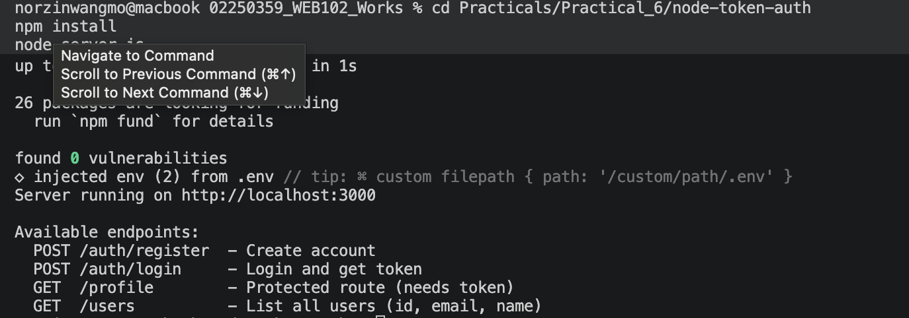

# Practical 6 — Token-Based Authentication (JWT)

**Student ID:** 02250359  
**Module:** WEB102  
**Project folder:** `node-token-auth/`  
**Full report:** [WEB102_Practical_6_Report.md](./WEB102_Practical_6_Report.md)

---

## Aim

Build a **Register + Login + Protected Route** system in Node.js using **JWT**. Passwords are hashed with bcrypt; protected routes verify the Bearer token before returning data. Homework adds **`name`** on register and a public **`GET /users`** list without exposing passwords.

---

## Instructions (from lab)

1. Set up Express with `jsonwebtoken`, `bcryptjs`, and `dotenv`.  
2. Implement `POST /auth/register` and `POST /auth/login`.  
3. Protect `GET /profile` with JWT middleware (`Authorization: Bearer <token>`).  
4. Test all endpoints in Thunder Client or Postman.  
5. **Homework:** accept `name` on register; add `GET /users` (`id`, `email`, `name` only).  
6. Submit code + screenshots (5 original flows + homework features).

---

## Technology stack

| Component | Role |
|-----------|------|
| Node.js + Express | HTTP API |
| jsonwebtoken | Sign and verify JWTs |
| bcryptjs | One-way password hashing |
| dotenv | `JWT_SECRET` and `PORT` from `.env` |
| In-memory array | User store (`data/users.js`) |

---

## Setup

```bash
cd node-token-auth
npm install
cp .env.example .env   # if .env is missing
node server.js
```

`.env`:

```env
JWT_SECRET=supersecretkey123
PORT=3000
```

API: http://localhost:3000

---

## Solution — auth flow

```
POST /auth/register (name, email, password)
    → bcrypt.hash → save user in memory
POST /auth/login (email, password)
    → bcrypt.compare → jwt.sign → return token
GET /profile
    → Authorization: Bearer <token>
    → verifyToken → jwt.verify → return req.user
GET /users
    → map users to { id, email, name } only
```

### Key files

| File | Purpose |
|------|---------|
| `server.js` | Express app, route mounting |
| `data/users.js` | Shared in-memory user store |
| `routes/auth.js` | Register (with name), login |
| `routes/protected.js` | `GET /profile` |
| `routes/users.js` | `GET /users` (homework) |
| `middleware/verifyToken.js` | Bearer JWT verification |

---

## API endpoints

| Method | Path | Auth | Description |
|--------|------|------|-------------|
| POST | `/auth/register` | No | Create account (`name`, `email`, `password`) |
| POST | `/auth/login` | No | Login; returns JWT |
| GET | `/profile` | Bearer token | Protected user info from token |
| GET | `/users` | No | All users — public fields only |

---

## Thunder Client tests

| # | Request | Expected |
|---|---------|----------|
| 1 | POST `/auth/register` with `name`, `email`, `password` | 201 |
| 2 | POST `/auth/login` | 200 + `token` |
| 3 | GET `/profile` + `Authorization: Bearer <token>` | 200 |
| 4 | GET `/profile` (no header) | 401 |
| 5 | GET `/profile` + fake token | 403 |
| 6 | GET `/users` | 200, no passwords |

Register body example:

```json
{
  "name": "Student",
  "email": "student@test.com",
  "password": "123456"
}
```

---

## Evidence (screenshots)

Place Thunder Client captures in `report-screenshots/` (add your own PNG files).

### Figure 1 — Register with name


### Figure 2 — Login (JWT returned)


### Figure 3 — Profile with valid token


### Figure 4 — Profile without token (401)


### Figure 5 — Profile with fake token (403)


### Figure 6 — GET /users (homework)


### Figure 7 — Server running (optional)


---

## Challenges (summary)

| Issue | Solution |
|-------|----------|
| 401 on profile with “valid” login | Use `Authorization: Bearer <token>`; copy full token |
| 409 on register | Email exists — restart server or new email |
| Empty `/users` list | Register a user first |
| `name` not on `/profile` | `name` is not in JWT payload — use `GET /users` or re-login after schema change |

See [WEB102_Practical_6_Report.md](./WEB102_Practical_6_Report.md) Section 6 for full detail.

---

## Completion checklist

- [x] Express project with JWT, bcrypt, dotenv  
- [x] `POST /auth/register` and `POST /auth/login`  
- [x] `verifyToken` middleware  
- [x] `GET /profile` protected  
- [x] Homework: `name` on register  
- [x] Homework: `GET /users` without passwords  
- [ ] Thunder Client screenshots in `report-screenshots/` (add after testing)

---

## References

- [JWT.io](https://jwt.io)  
- [jsonwebtoken](https://www.npmjs.com/package/jsonwebtoken)  
- [bcryptjs](https://www.npmjs.com/package/bcryptjs)  
- [Express routing](https://expressjs.com/en/guide/routing.html)
