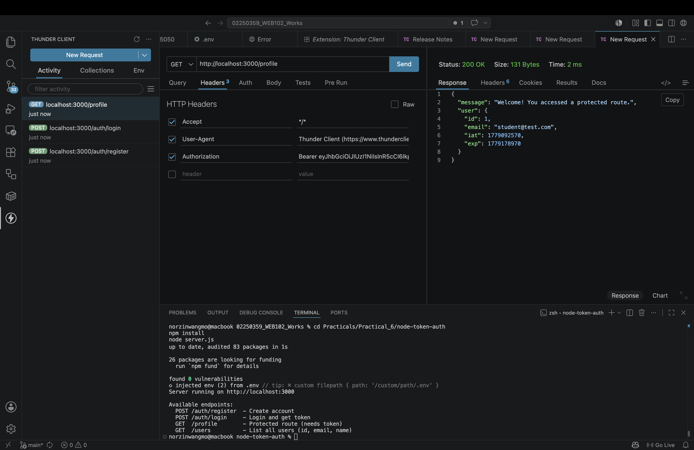
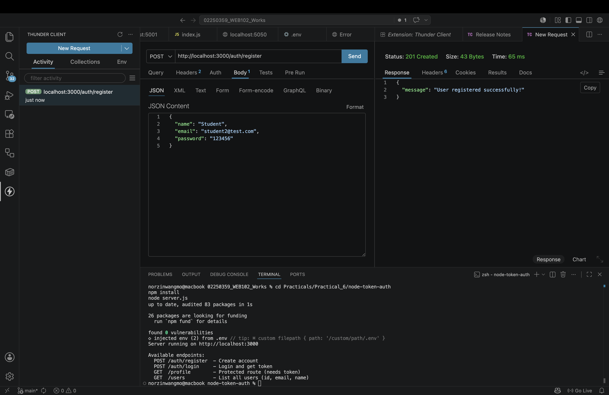
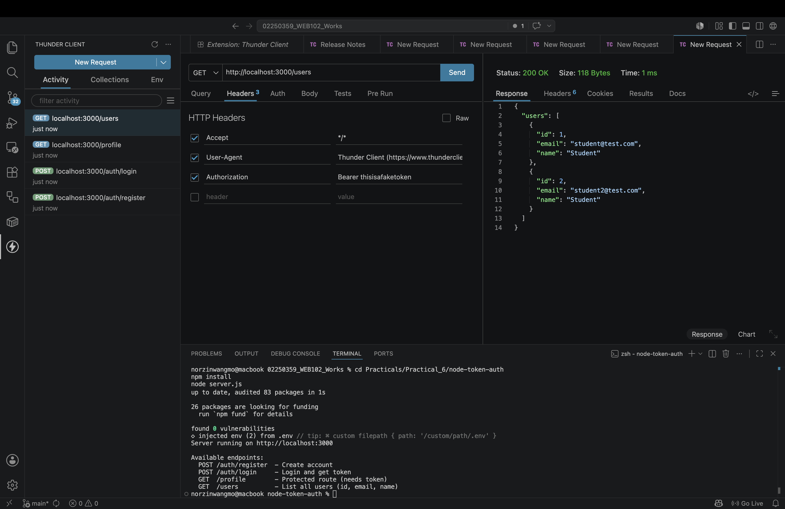
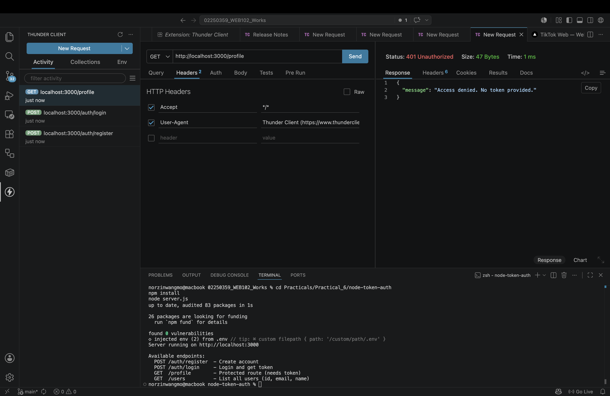
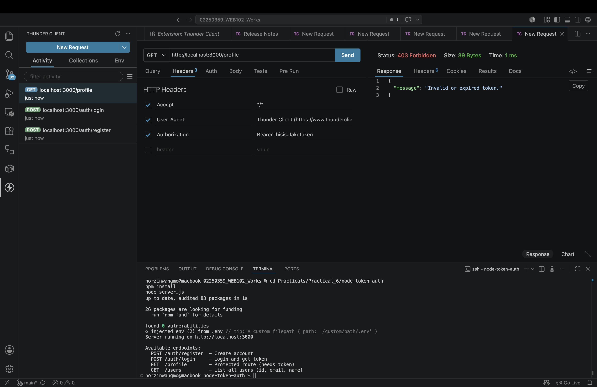
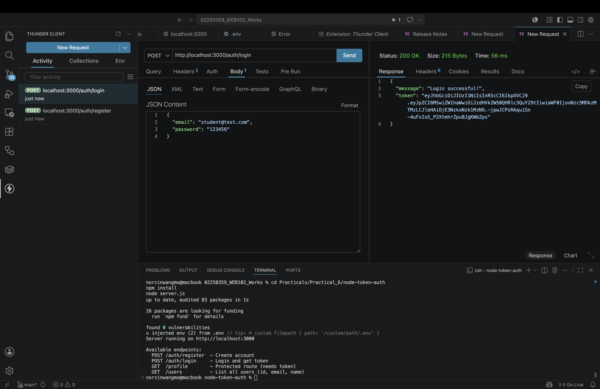

# Practical 6 — Reflection

**Student ID:** 02250359  
**Module:** WEB102  
**Practical:** Token-Based Authentication (JWT)

---

## a) Documentation — Main concepts applied

### Token-based auth vs sessions
In **session-based** auth the server remembers each user (session store). In **token-based** auth the server issues a **signed JWT** at login; the client sends it on every protected request. The server only verifies the signature with `JWT_SECRET` — no session table required. This scales better across multiple servers.

### JWT structure
A JWT is `HEADER.PAYLOAD.SIGNATURE`. The payload is Base64-encoded (readable on [jwt.io](https://jwt.io)), not encrypted. The **signature** proves the token was created with our secret and was not modified. Passwords and secrets must never appear in the payload.

### Password security (bcrypt)
On register, `bcrypt.hash(password, 10)` stores a one-way hash. On login, `bcrypt.compare(plain, hash)` checks the password without storing or transmitting plain text. Even with database access, attackers cannot easily recover the original password.

### Express middleware
`verifyToken` runs before `GET /profile`:
1. Parse `Authorization: Bearer <token>`  
2. Return **401** if no token  
3. `jwt.verify` → set `req.user` → `next()`  
4. Return **403** if token invalid or expired  

### Shared in-memory store
`data/users.js` exports one `users` array used by `routes/auth.js` (write on register) and `routes/users.js` (read for homework list). This avoids duplicate arrays and circular imports between route files.

### Homework design
- **`name`** is stored on the user object at registration.  
- **`GET /users`** returns `{ id, email, name }` only — password hashes are stripped via `.map()`.  
- JWT at login still contains only `{ id, email }`, so `/profile` illustrates **stale token data** if profile fields change after login (lab discussion point).

---

## b) Reflection — What I learned

### What I learned
- The end-to-end flow: register → hash → login → sign JWT → Bearer header → middleware → protected response.  
- When to use **401** (not authenticated) vs **403** (invalid/expired token).  
- Why JWTs are convenient for SPAs and mobile apps but require careful secret management (`.env`, never commit secrets).  
- That token claims can be **out of date** compared to the database (or in-memory store) until the user obtains a new token.  
- How to expose a **public user list** safely by selecting only non-sensitive fields.

### Challenges faced and how I overcame them

#### 1. Authorization header format
**Challenge:** `GET /profile` returned 401 even after a successful login.  
**How I fixed it:** Set header key `Authorization` and value `Bearer ` + full token (single space after Bearer, no extra quotes). Copied the entire token string from the login JSON response.

#### 2. Duplicate email on register
**Challenge:** Second register with the same email returned **409 Conflict**.  
**How I fixed it:** Used a new email for testing or restarted `node server.js` to clear the in-memory store.

#### 3. Sharing users between routes
**Challenge:** Homework `GET /users` needed the same data as register/login.  
**How I fixed it:** Moved the array to `data/users.js` and required it from both `auth.js` and `users.js`.

#### 4. Understanding 401 vs 403 on profile
**Challenge:** Confusion between “no token” and “bad token” responses.  
**How I fixed it:** Test 4 — no header → 401; Test 5 — `Bearer thisisafaketoken` → 403. Documented both in Thunder Client screenshots.

#### 5. JWT payload vs stored user data
**Challenge:** `/profile` does not show `name` after homework, while `GET /users` does.  
**How I understood it:** `name` was added to the user object but not to `jwt.sign()` payload — profile reflects the token, not the live store. Production apps often load profile from the DB on each request or include minimal claims plus refresh tokens.

### Implementation evidence

| Area | File |
|------|------|
| Register + login + bcrypt | `node-token-auth/routes/auth.js` |
| JWT middleware | `node-token-auth/middleware/verifyToken.js` |
| Protected profile | `node-token-auth/routes/protected.js` |
| Public user list | `node-token-auth/routes/users.js` |
| App entry | `node-token-auth/server.js` |

---

## Summary

Practical 6 implemented **stateless JWT authentication** in a small Express API, from password hashing through middleware-protected routes, plus homework for **named users** and a **safe public listing**. This connects earlier module work: **REST APIs** (Practicals 1–2), **persistence and JWT with Prisma** (Practical 4), and **cloud-backed apps** (Practical 5) that still rely on app-level JWT for API access.

For the full step-by-step report, see [WEB102_Practical_6_Report.md](./WEB102_Practical_6_Report.md).
